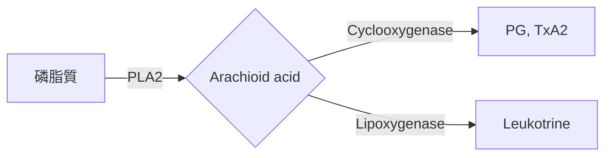

## Histamine
|    | G  | 位置         | 藥名                                  | 功能             |
|----|----|--------------|---------------------------------------|------------------|
| H1 | Gq | 腺體、平滑肌 | **Diphenhydramine、Meclizine**            | 過敏、**暈車、鎮靜** |
|    |    |              | Chlorpheniramine                      | 過敏             |
|    |    |              | Loratadine、Cetririzine、Fexofenadine | 過敏             |
| H2 | Gs | 胃壁細胞     | Cime**tidine**、Rani**tidine**                | 胃潰瘍           |
- H1 : 過敏 (除心跳加速)，H2 : 胃酸分泌、心跳加速
## Serotonin
|      | 受器         | 作用       | 藥物           | 補充            |
|------|--------------|------------|----------------|-----------------|
| 5HT1 | Gi           | **1A**抗焦慮   | **Bus**piron       | (+)             |
|      |              | **1D**解偏頭痛 | Sumatriptan    | (+)             |
| 5HT2 | Gq           | 肌肉收縮   | Cyproheptadine | (-) 治療5HT過多 |
|      |              |           | Kera**sertin**      | (-) 降血壓      |
|      |              |           | Lorcaserin      | (+) 增加飽足感  |
| 5HT3 | Na/K channel | 嘔吐(CTZ)  | Ondan**serton**    | (-) 止吐        |
| 5HT4 | Gs           | 腸道蠕動   | Cisa**pride**      | (+)             |
- 回收抑制 : [[抗憂鬱]]
## Eicosanoid

### 酶 (-)
| 機轉     | 藥名           | 作用                        | 副作用            |
|----------|----------------|-----------------------------|-------------------|
| PLA2 (-) | Corticosteroid | 強抗發炎                    |  Cushing syndrome |
| COX (-)  | Aspirin        | 抗血小板                    | 小孩病毒**Reye** syn. |
|          | Ibuprofen      | 最安全、**急性痛風**            |                   |
|          | Ketoprofen     | 也抑制LOX                   |                   |
|          | Indomethacin   | **關閉PDA、急性痛風、抑制宮縮** |                   |
|          | Ketorolac      | 止痛最強                    | 腎/胃最強         |
|          | Diclofenac     |                             | 肝最強            |
| COX2 (-) | Celecoxib      |                             | 副作用最小        |
|          | Rofecoxib      |                             | 血栓風險          |
| 非NASID  | Acetaminophen  | CNS退燒、止痛               | 肝毒性(NAC解)     |
| LOX (-)  | Zi**leu**ton       | 解氣喘                      |                   |
- Steroid副作用 : [[syndrome#^327c2c|Cushing syndrome]]
### Eicosanoid (+)
- PGE/F : Prostaglandin、PGI : Prostacyclin
- 原則
	- PG多**血管舒張，可開PDA、解肺動脈高壓**，除了PGF(青光眼)
	- PG收縮**子宮平滑肌**、減少產後出血

|      | 藥名                                 | 作用                 |
|------|--------------------------------------|----------------------|
| PGE1 | **Miso**prostol                          | 保護**胃**黏膜、降低胃酸 |
|      | **A**lprostadil                          | 開PD**A**                |
| PGE2 | Dinoprostone                         | 墮胎                 |
| PGF2 | Lantao**prost**                          | 青光眼               |
| PGI2 | Epoprostenol、Treprostinil、Iloprost | 降肺高壓             |
- #h/red  ==喝Miso胃很舒服==
- Misoprostol、Carboprost : 子宮收縮

| Leukotriene modifier | 機制        | 藥名        | 特別使用                             |
|----------------------|-------------|-------------|--------------------------------------|
|                      | 5-LOX (-)   | Ze**leuton**    | Aspirin induced Asthma、不會吸的小孩 |
|                      | Recptor (-) | Zafir**lukast** |                                      |
## 痛風
1. Acute 
	- 抑制發炎 : NASID (**Indomethacin、Ibuprofen**)
	- 抑制白血球趨化 : **Colchicine**
2. Chronic
	- 抑制尿酸形成 : Xanthine oxidase (**Allopurinol、Febuxostat**) <- **HLA-B5801**有SJS
	- 抑制尿酸PCT再吸收 : **Probenecid、Benzbromarone、Sulfinpyrazone**
	- 溶解尿酸 : Pegloti**case**、Rasb**uricase**
		- 重組尿酸酶
		- 預防tumor lysis syndrome